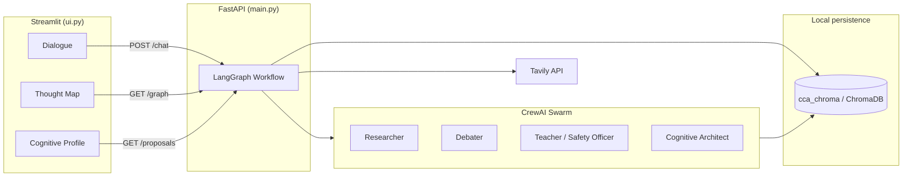

# Cognitive Challenge Agent (CCA)

[](LICENSE)
[](https://www.python.org/downloads/)
[](#security--privacy)

A **local-first, multi-agent reasoning workspace** that challenges your ideas through adversarial debate, web-grounded research, and Socratic dialogue. Your intellectual history stays on your machine in a private vector database — never uploaded to a shared cloud by default.

---

## Table of contents

- [Overview](#overview)
- [Features](#features)
- [Architecture](#architecture)
- [Tech stack](#tech-stack)
- [Prerequisites](#prerequisites)
- [Quick start](#quick-start)
- [Configuration](#configuration)
- [API reference](#api-reference)
- [Repository structure](#repository-structure)
- [Security & privacy](#security--privacy)
- [License](#license)
- [Contributing](#contributing)
- [Author](#author)

---

## Overview

Most AI assistants optimize for agreement. **CCA** optimizes for **intellectual friction**: it stress-tests your claims, grounds arguments in retrieved evidence, and stores a growing map of how you think over time.

The system runs entirely on your workstation. The FastAPI backend binds to `127.0.0.1`, semantic memory persists in a local ChromaDB directory, and API keys live in a `.env` file that never enters version control.

| Mode | Behavior |
|------|----------|
| **Exploration** | Decomposes ideas into learning paths without full adversarial debate |
| **Adversarial** | Multi-agent swarm: research → red-team critique → Socratic synthesis |
| **Socratic** | Same swarm pipeline, tuned for guided inquiry rather than pure opposition |

For the full security model, agent governance, and hardening guidance, see [docs/security.md](docs/security.md).

---

## Features

- **Multi-agent debate** — CrewAI roles (Researcher, Debater, Teacher) orchestrated by a LangGraph workflow
- **Intent-aware routing** — Classifies each message and routes to exploration or swarm debate
- **Semantic memory (RAG)** — Retrieves related past thoughts from ChromaDB before responding
- **Web research** — Tavily-backed search with sandboxed, untrusted-data markers for prompt-injection mitigation
- **Evolutionary audits** — A Cognitive Architect agent compares sessions and proposes learning quests
- **Thought graph UI** — Streamlit workspace with dialogue, interactive thought map, and cognitive profile tabs
- **Sycophancy filter** — Flags when agents drift toward overly agreeable “helpful assistant” tone

---

## Architecture



**Workflow stages** (LangGraph nodes in `main.py`):

1. **Context retriever** — Semantic search over prior thoughts  
2. **Intent detector** — `exploration` \| `adversarial` \| `socratic`  
3. **Researcher** — Optional Tavily fetch (adversarial / socratic only)  
4. **Agent swarm** or **knowledge expansion** — Debate path vs. exploration path  
5. **Reflection engine** — Evolutionary audit and learning proposals  
6. **Memory committer** — Persists user assertions with metadata  

---

## Tech stack

| Layer | Technology |
|-------|------------|
| Orchestration | [LangGraph](https://github.com/langchain-ai/langgraph) |
| Agents | [CrewAI](https://github.com/crewAIInc/crewAI) |
| LLM & embeddings | Google Gemini (`langchain-google-genai`) |
| API server | [FastAPI](https://fastapi.tiangolo.com/) + Uvicorn |
| Vector store | [ChromaDB](https://www.trychroma.com/) (local persistent client) |
| Web search | [Tavily](https://tavily.com/) |
| Frontend | [Streamlit](https://streamlit.io/) + `streamlit-agraph`, `streamlit-chat` |

---

## Prerequisites

- **Python 3.11+**
- API keys (free tiers available for development):
  - [Google AI Studio](https://aistudio.google.com/) — Gemini LLM and embeddings → `GOOGLE_API_KEY`
  - [Tavily](https://tavily.com/) — web research → `TAVILY_API_KEY`

---

## Quick start

### 1. Clone the repository

```bash
git clone https://github.com/MANU-de/cognitive-challenge-agent.git
cd cognitive-challenge-agent
```

### 2. Create a virtual environment and install dependencies

```bash
python3 -m venv .venv
source .venv/bin/activate   # Windows: .venv\Scripts\activate
pip install -r requirements.txt
```

### 3. Configure environment variables

```bash
cp .env.example .env
```

Edit `.env` and set your API keys. **Do not commit `.env`** — it is listed in `.gitignore`.

### 4. Start the backend

```bash
python main.py
```

The API listens at **http://127.0.0.1:8000** (localhost only).

### 5. Start the UI (second terminal)

```bash
streamlit run ui.py
```

Open the URL Streamlit prints (typically **http://localhost:8501**).

---

## Configuration

| Variable | Required | Description |
|----------|----------|-------------|
| `GOOGLE_API_KEY` | Yes | Gemini chat model and `gemini-embedding-001` embeddings |
| `TAVILY_API_KEY` | Yes | Advanced web search for adversarial / socratic modes |

Copy [.env.example](.env.example) as a template. Restrict API keys in provider dashboards when possible (see [docs/security.md](docs/security.md)).

**Runtime data** (created automatically, not in git):

| Path | Contents |
|------|----------|
| `cca_chroma/` | ChromaDB vectors, documents, metadata (your Idea Graph) |

---

## API reference

| Method | Endpoint | Description |
|--------|----------|-------------|
| `POST` | `/chat` | Body: `{"message": "..."}` → intent + agent response |
| `GET` | `/graph` | Nodes and edges for the thought-map visualization |
| `GET` | `/proposals` | Latest evolutionary learning proposals (up to 3) |

Example:

```bash
curl -X POST http://127.0.0.1:8000/chat \
  -H "Content-Type: application/json" \
  -d '{"message": "Remote work always increases productivity."}'
```

---

## Repository structure

```
cognitive-challenge-agent/
├── main.py              # FastAPI app, LangGraph workflow, HTTP routes
├── agents.py            # CrewAI agent definitions (roles & backstories)
├── memory.py            # ChromaDB semantic memory + Gemini embeddings
├── tools.py             # Tavily web search wrapper
├── ui.py                # Streamlit frontend (dialogue, graph, profile)
├── requirements.txt     # Python dependencies
├── .env.example         # Environment variable template (safe to commit)
├── .gitignore           # Excludes secrets, venv, and cca_chroma/
├── LICENSE              # Polyform Noncommercial License 1.0.0
├── README.md            # This file
└── docs/
    └── security.md      # Security architecture & governance (Phase 4)
```

**Not tracked in git** (by design):

- `.env` — API credentials  
- `.venv/` — virtual environment  
- `cca_chroma/` — private thought graph and embeddings  

---

## Security & privacy

CCA treats your reasoning history as sensitive intellectual property.

- **Localhost binding** — Backend listens on `127.0.0.1` only  
- **Secrets isolation** — `.env` and vector data excluded via `.gitignore`  
- **External data sandboxing** — Web results wrapped in untrusted-data markers  
- **Agent governance** — Teacher agent cross-checks debate against research  
- **Disk encryption** — Recommended for the project directory (FileVault, BitLocker, LUKS)  

Full details: **[docs/security.md](docs/security.md)**

If you discover a security issue, please report it privately via [GitHub Security Advisories](https://github.com/MANU-de/cognitive-challenge-agent/security/advisories/new) rather than opening a public issue with exploit details.

---

## License

This project is licensed under the **[Polyform Noncommercial License 1.0.0](LICENSE)**.

| You may | You may not (without a separate agreement) |
|---------|---------------------------------------------|
| Use, modify, and distribute the software for **noncommercial** purposes | Use the software for purposes primarily aimed at **commercial advantage** or monetary compensation |
| Exercise copyright and relevant patent rights granted in the license | Rely on implied patent, trademark, or trade-secret rights beyond the license text |

**Author:** Manuela Schrittwieser

**Summary of key terms:**

- **Noncommercial use only** — Personal research, education, and hobby projects are in scope; commercial products and paid services generally are not.
- **No warranty** — The software is provided *as is*; the author is not liable for damages arising from use.
- **Patent retaliation** — If you assert that the software infringes your patent, your license under these terms ends immediately.
- **Termination** — Violations end the license immediately; reinstatement is possible if you cure the violation within 30 days of notice.

For the authoritative legal text, read the full [LICENSE](LICENSE) file. If you need commercial licensing, contact the author through the repository.

---

## Contributing

Contributions are welcome for noncommercial use under the same license.

1. Fork the repository and create a feature branch from `master`.
2. Keep changes focused; match existing code style and conventions.
3. Never commit `.env`, `cca_chroma/`, or other paths listed in `.gitignore`.
4. Open a pull request with a clear description of the problem and solution.

Before submitting, run the backend and UI locally and verify `/chat`, `/graph`, and `/proposals` behave as expected.

---

## Author

**Manuela Schrittwieser**

- Repository: [github.com/MANU-de/cognitive-challenge-agent](https://github.com/MANU-de/cognitive-challenge-agent)
- License: Polyform Noncommercial 1.0.0 — see [License](#license)

---

<p align="center">
  <sub>Built for thinkers who want friction.</sub>
</p>

